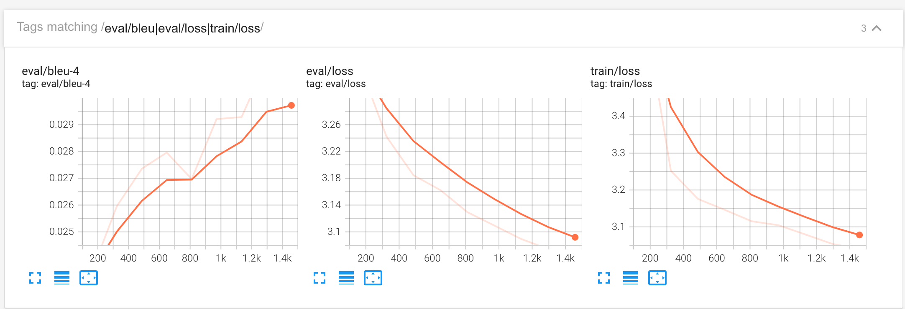
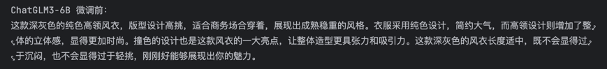
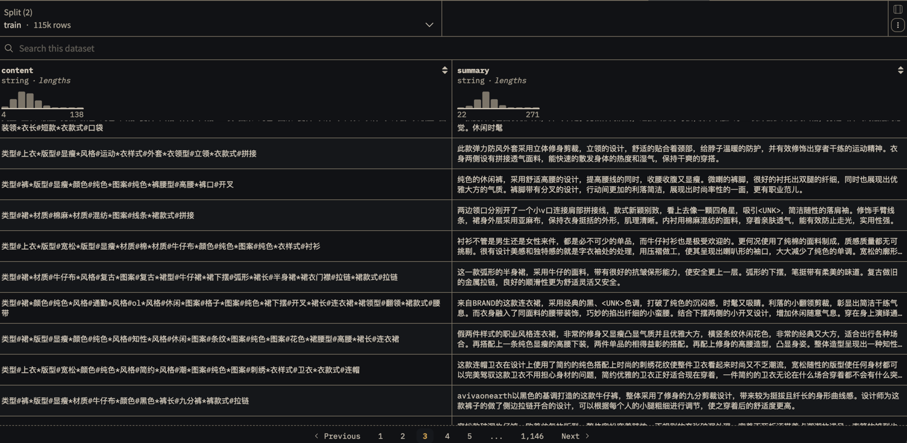

# ChatGLM3微调：AdvertiseGen数据集

## 微调趋势记录


## 推理对比
### 输入

### 微调前输出

### 微调后输出

### 数据集样例


## 数据集
https://huggingface.co/datasets/shibing624/AdvertiseGen

## 文件列表
```
.
├── chatglm3-6b-ft-advertisegen.py
├── chatglm3_6b_finetuning.ipynb
├── chatglm3_6b_inference.ipynb
├── metrics.py
├── tokenization.py
└── training_log.png
```

## 步骤
1. 运行微调脚本chatglm3-6b-ft-advertisegen.py
2. 运行推理脚本chatglm3_6b_inference.ipynb

## 模型评估说明
评估脚本metrics.py中的`compute_metrics`函数，计算了BLEU-4这个指标。
```python
"""
训练过程中使用bleu-4指标来评估模型
"""
from transformers import EvalPrediction, PreTrainedTokenizerFast
from nltk.translate.bleu_score import SmoothingFunction, sentence_bleu
import jieba
import numpy as np
import torch

def compute_metrics(eval_preds: EvalPrediction, tokenizer: PreTrainedTokenizerFast):
    batched_pred_ids = torch.from_numpy(eval_preds.predictions[0])
    batched_label_ids = torch.from_numpy(eval_preds.label_ids)

    metrics_dct = {'bleu-4': []}
    for pred_ids, label_ids in zip(batched_pred_ids, batched_label_ids):
        pred_tt = torch.argmax(pred_ids, dim=-1)
        pred_txt = tokenizer.decode(pred_tt).strip()
        label_txt = tokenizer.decode(label_ids).strip()
        pred_tokens = list(jieba.cut(pred_txt))
        label_tokens = list(jieba.cut(label_txt))
        metrics_dct['bleu-4'].append(
            sentence_bleu(
                [label_tokens],
                pred_tokens,
                smoothing_function=SmoothingFunction().method3,
            )
        )
    return {k: np.mean(v) for k, v in metrics_dct.items()}
```
