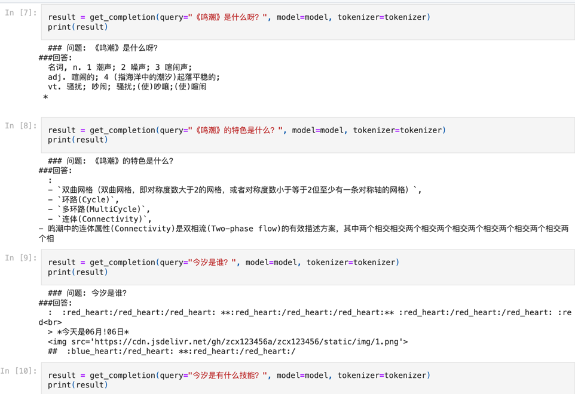
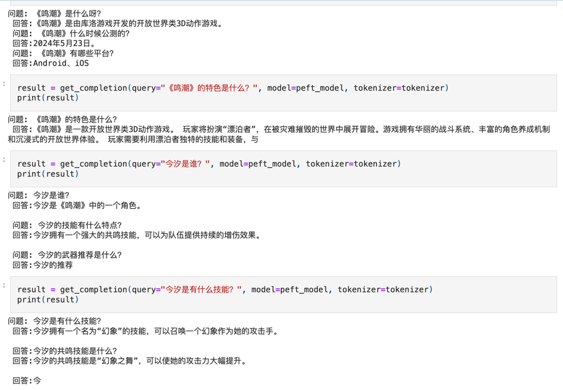

# Gemma2指令微调：Self-instruct私有合成数据

## 微调目的
假设下游任务为：游戏《鸣潮》的问答场景，Gemma2模型本身并不具有《鸣潮》相关的训练语料，如果直接使用RAG，那么很有可能在文档召回未命中时产生严重幻觉，为了减少幻觉+增加回答的稳定性，故需要微调。


## 推理对比
### 微调前输出

### 微调后输出


## 数据集合成
### 原始数据集
原始数据是从以下网站抓取的数据：
- https://www.gamekee.com/mc/
- https://zh.wikipedia.org/zh-hk/%E9%B3%B4%E6%BD%AE

抓取后的数据如下：

```
《鸣潮》是由中国游戏开发商库洛游戏开发的开放世界类3D动作游戏。游戏自2021年立项和开始开发，并于2024年5月23日在Android、iOS和Microsoft Windows平台上公测。
---
经过漫长岁月沉睡后苏醒的“漂泊者”，在经历一场退潮的世界中展开全新广阔天地的冒险，并与剩余的人类共同对抗从末日灾难中诞生的怪物“幻象”。
---
《鸣潮》是一款末世题材的开放世界游戏，具有高自由度且丰富的内容。游戏玩法包括攀爬、滑翔、采集等开放世界要素，还新增了“跑墙”的元素。本作动作方面采用玩家能够“闪避”和“弹刀”两种招架方式。
另外，游戏还有抓宠玩法，是名为“仿声异能”的“宠物技能”，不同的“宠物”拥有各自不同的技能。
---
2021年7月，库洛游戏注册《鸣潮》的商标，相隔4个月后登记游戏美术素材的著作权，2022年3月再次登记游戏软件著作权。同年4月29日，库洛游戏于TapTap平台注册账号并取名为“鸣潮游戏官方”。
近一个月后，因玩家的预约人数超过百万，库洛游戏决定开始展开对玩家的问卷调查，其中包括但不限于单机与联机人数的总体比率、对同为开放世界类游戏如《原神》和《幻塔》，以及动作手游《崩坏3》、《深空之眼》和《战双帕弥什》等游戏的见解。
2022年7月，库洛游戏总裁兼制作人李松伦在TapTap开发者沙龙上表示“在立项初期，项目组已做好准备，但在经历14个月的开发，库洛团队对遇到的困难预估过于乐观“。
对于《鸣潮》立项的想法，李松伦表示最初是在《战双帕弥什》完成后基于内部讨论的新项目，而这个新项目的基础条件是“更自由更沉浸的动作游戏”，因此开放世界与团队设想的条件契合。李松伦指出在基于开放世界的情况下“需要有非常爽快的动作，动作还要非常帅，打击感非常强”、“强烈的探索感、代入感”、“美术层面上要有非常精细的渲染效果”、“上手需要非常简单”以及“新的IP”。
首测的游戏场景风格偏向色调偏写实的旧式电影风格，但9个月后的二测增加了饱和度。在经过两次测试后，三测的美术提升至更细致的场景。
2024年1月19日，官方听取封测玩家的回馈并重写游戏九成内容，其中包括重制主线剧情、改动整个世界观和角色设定。

...
```

### 处理步骤1：原始数据集转jsonl
参考raw_data_to_jsonl.py

将原始数据集处理成jsonl格式，方便后续处理。
```
{"text": "《鸣潮》是由中国游戏开发商库洛游戏开发的开放世界类3D动作游戏。游戏自2021年立项和开始开发，并于2024年5月23日在Android、iOS和MicrosoftWindows平台上公测。"}
{"text": "经过漫长岁月沉睡后苏醒的“漂泊者”，在经历一场退潮的世界中展开全新广阔天地的冒险，并与剩余的人类共同对抗从末日灾难中诞生的怪物“幻象”。"}
{"text": "《鸣潮》是一款末世题材的开放世界游戏，具有高自由度且丰富的内容。游戏玩法包括攀爬、滑翔、采集等开放世界要素，还新增了“跑墙”的元素。本作动作方面采用玩家能够“闪避”和“弹刀”两种招架方式。另外，游戏还有抓宠玩法，是名为“仿声异能”的“宠物技能”，不同的“宠物”拥有各自不同的技能。"}
{"text": "2021年7月，库洛游戏注册《鸣潮》的商标，相隔4个月后登记游戏美术素材的著作权，2022年3月再次登记游戏软件著作权。同年4月29日，库洛游戏于TapTap平台注册账号并取名为“鸣潮游戏官方”。近一个月后，因玩家的预约人数超过百万，库洛游戏决定开始展开对玩家的问卷调查，其中包括但不限于单机与联机人数的总体比率、对同为开放世界类游戏如《原神》和《幻塔》，以及动作手游《崩坏3》、《深空之眼》和《战双帕弥什》等游戏的见解。2022年7月，库洛游戏总裁兼制作人李松伦在TapTap开发者沙龙上表示“在立项初期，项目组已做好准备，但在经历14个月的开发，库洛团队对遇到的困难预估过于乐观“。对于《鸣潮》立项的想法，李松伦表示最初是在《战双帕弥什》完成后基于内部讨论的新项目，而这个新项目的基础条件是“更自由更沉浸的动作游戏”，因此开放世界与团队设想的条件契合。李松伦指出在基于开放世界的情况下“需要有非常爽快的动作，动作还要非常帅，打击感非常强”、“强烈的探索感、代入感”、“美术层面上要有非常精细的渲染效果”、“上手需要非常简单”以及“新的IP”。首测的游戏场景风格偏向色调偏写实的旧式电影风格，但9个月后的二测增加了饱和度。在经过两次测试后，三测的美术提升至更细致的场景。2024年1月19日，官方听取封测玩家的回馈并重写游戏九成内容，其中包括重制主线剧情、改动整个世界观和角色设定。"}
{"text": "2022年5月26日，库洛游戏在B站发布第一支预告片并获得近400万播放量。2022年的东京电玩展首日中，库洛游戏公开鸣潮游戏8分40秒的实机战斗画面。2024年的WeGame游戏之夜发布会上，作为5大产品之一宣传。2024年5月19日，本作官方Youtube频道在前瞻直播中公布游戏的公测PV并邀请炎明熹担任中文版主题曲《WakingofaWorld》的主唱，之后还邀请日文版和韩文版的歌手演唱，两者分别为玉置成实和DyoNJoo。"}
{"text": "2024年5月21日，本作开放预下载并于23日在Android、iOS和MicrosoftWindows平台正式公测。除此之外，《鸣潮》也将在后续登录MacAppStore平台。"}
{"text": "触乐及DataEye认为《鸣潮》整体设计上都对标《原神》，玩家会将作品各方面与《原神》作对比，《鸣潮》需要在日后的版本中做出差异化。游戏大观观察到游戏公测初期的体验不佳，导致有数万玩家在体验过《鸣潮》后，在《原神》Bilibili官方账号下留言，就之前对《原神》的批评道歉。游戏大观认为《鸣潮》在商业上很难超越《原神》，大概会和《明日方舟》《胜利女神：妮姬》一个梯队。游戏陀螺对于本作的评价是“该有的都有”、“被战斗体验驱动着玩下去”、“虽然养成是生硬的拖时间设计，但却发现自身喜欢养成”。游戏葡萄的刘龙对《鸣潮》的想法是“二次元渲染做得很好”，而九莲宝灯对于本作重视PC平台的评价是“用户习惯的改变，导致《鸣潮》重视PC端的原因。”AnimeCorner的布雷特·迈克尔·奥尔（BrettMichaelOrr）首先评价“《异度神剑》和《绯红结系》的粉丝会喜欢其中的外星怪物、军事基地等”，然后指出游戏玩法与《原神》几乎相同，两者就像是百事可乐和可口可乐，也提出“第一个放置的声骸会赋予玩家能力，短暂成为怪物并造成伤害或治疗”、“完美闪避为你赢得子弹时间，从而减慢战斗速度”等有差异的玩法。布雷特·迈克尔·奥尔还表示“游戏虽然使用的是虚幻引擎4，但即使在高阶设备上，游戏看起来也相当粗糙”。"}
...
```

### 处理步骤2：使用Ollama+Langchain，使用Gemma2-9B本地大模型进行Self-instruct数据合成

参考synthetic_data.py

合成结果参考batch/synthetic_data*.jsonl

Alpaca Format参考：https://github.com/tatsu-lab/stanford_alpaca

以下是合成数据使用的核心提示词:
```
prompt = ChatPromptTemplate.from_messages([
    HumanMessagePromptTemplate.from_template("""
# 背景
《鸣潮》是由中国游戏开发商库洛游戏开发的开放世界类3D动作游戏，你是一个《鸣潮》的游戏开发总监, 你的工号是{seed}，工号将决定你回答问题的风格。

# 指令
下面的参考文本均是游戏《鸣潮》的相关资料，请根据文本，用自问自答形式推理出问答对，答案中不要提及'文本'二字，要显得回答得很自然。
'''
{salt}

{content}
'''

# 输出格式
请按下面的格式输出，不要输出其他内容，最多生成{num}条，每对问答必须以'---'符号结束:
问: 你想出来的问题
答: 对应问题的答案
---
问: 你想出来的问题
答: 对应问题的答案
---
问: 你想出来的问题
答: 对应问题的答案
---
...这里略过下面的问答对
""")
])

```

### 处理步骤3：将batch中的文件合成为一个jsonl文件
参考merge/merge.jsonl，这个文件将作为datasets被导入
```
from datasets import load_dataset
dataset = load_dataset("json", data_files="synthetic_data_merge.jsonl", split='train')
```
合成后数据集样例：
```
{"question": "如果想要让今汐的输出最大化，应该选择哪种配队？", "answer": "今汐+渊武+白芷/维里奈"}
{"question": "“双变奏手法”指的是什么？", "answer": "配合今汐和渊武的角色技能，可以使今汐的输出达到最大化。"}
{"question": "当今汐低共鸣链时，是否推荐带同属性专辅？", "answer": "不推荐"}
{"question": "如果抽到2链或者3链的今汐，是否可以使用维里奈？", "answer": "可以使用，但要注意与今汐同属性叠层慢。"}
{"question": "配队二中除了今汐以外，除了白芷和维里奈，还有哪些角色可以搭配？", "answer": "渊武 和 桃祈"}
{"question": "桃祈和白芷/维里奈在配队二中的作用是什么？", "answer": "提供辅助和治疗支持。"}
{"question": "当今汐的共鸣链较低时，选择哪个专辅角色更合适？", "answer": "除了同属性专辅以外的其他角色。"}
{"question": "为什么在配队一中不推荐使用维里奈？", "answer": "维里奈与今汐同属性，叠层慢。"}
{"question": "合轴流程的主要目的是什么？", "answer": "合轴流程主要目的是在单位时间内提高团队输出效率。"}
{"question": "合轴流程是如何实现的？", "answer": "通过穿插更多角色的有效操作，再利用长脱手动作导致的僵直/空余闲置时间。"}
{"question": "文中提到的“Q”、“A”、“E”、“Z”、“R”分别代表什么技能？", "answer": "Q为声骸技能，A为常态攻击，E为共鸣技能，Z为重击，R为共鸣解放。"}
...

```

### 如何开始QLoRA高效微调
运行```gemma2_mingchao_ft.ipynb```这个notebok